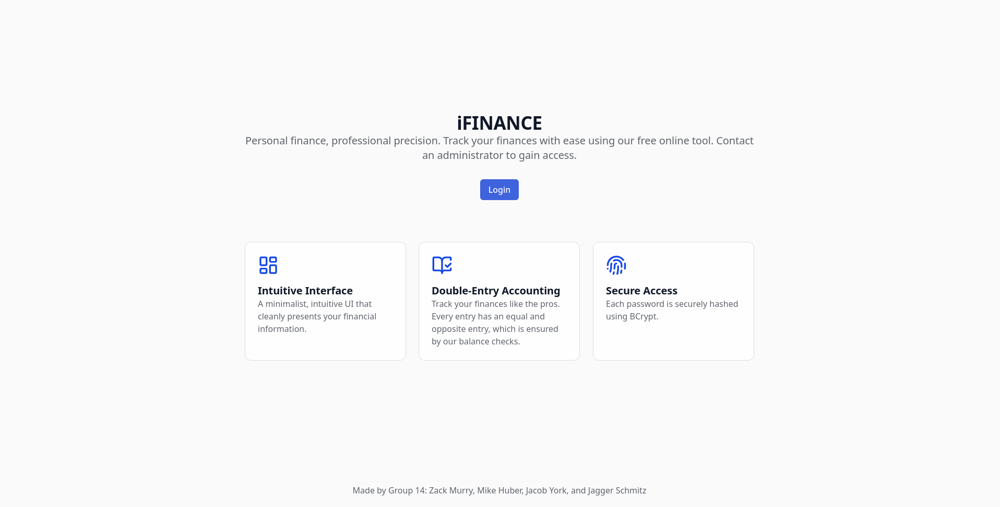
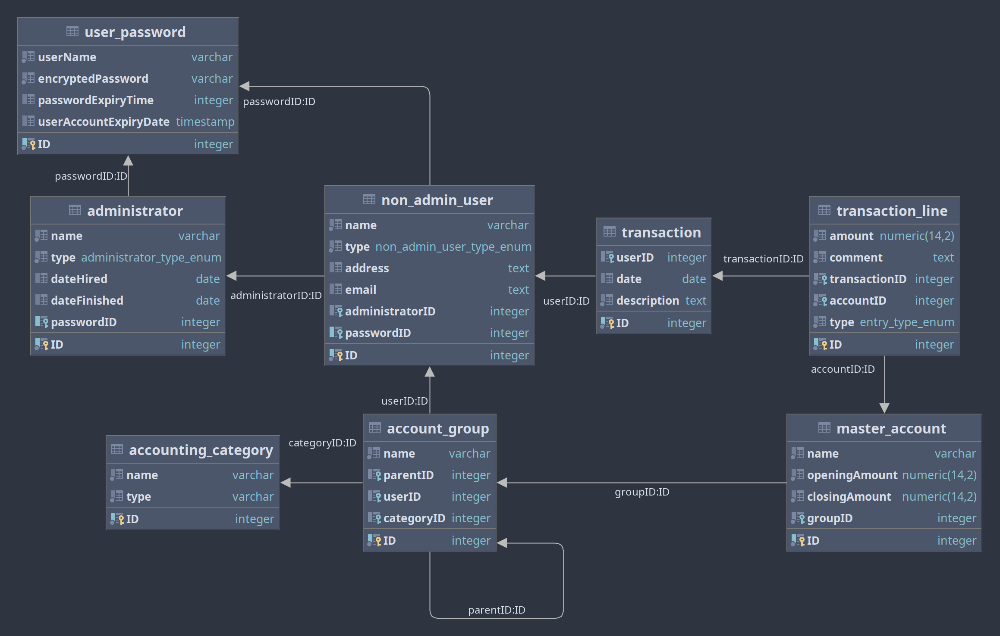

# CS 4320 Group 14 Project 2: iFINANCE

Spring 2025 Software Engineering with Dr. Ouda

Group 14 members: Zack Murry, Mike Huber, Jacob York, and Jagger Schmitz

**Demo video**: demo.mp4  
**Live deployment**: https://ifinance.zackmurry.com  
**GitHub link**: https://github.com/ZackMurry/cs4320-project



## Contents

- [Requirements](#requirements)
- [Setup](#setup)
- [Execution](#execution)
- [Project Structure](#project-structure)
- [SQL Database Tables](#sql-database-tables)
  - [ER Diagram](#er-diagram)
  - [Further Table Details](#further-table-details)
- [Overview of Tools](#overview-of-tools)
  - [Next.js](#nextjs)
  - [Express.js](#expressjs)
  - [NGINX](#nginx)

## Requirements

This software setup is required for running the web server. Versions do not have to be exact.

- NGINX version 1.26.3
- Node.js version 22.11.0
  - NPM version 10.9.0
- PostgreSQL version 17.2
- Linux (may work on other operating systems)

For ease of use, we have deployed the website on the cloud for testing at this domain: ifinance.zackmurry.com

- Please don't change the default admin username or password on our hosted instance

## Setup

Copy `backend/.env.example` to `backend/.env` and change the values to match your PostgreSQL credentials.

## Execution

The `start.sh` Bash script will install all dependencies (besides the software listed in the Requirements section), configure the database, and start the web server.
The processes started by this script include:

- Frontend Next.js server on port 3000
- Backend Node.js server on port 8080
- NGINX reverse proxy on port 80
  - This directs HTTP requests as follows:
    - Requests to /api/\*\* are sent to port 8080 (backend)
    - All other requests are sent to port 3000 (frontend)

The script can be run using `bash start.sh`.
The server can be terminated by exiting from the `start.sh` script.

## Project Structure

```
# Base directory for frontend React/Next.js application
/frontend
  # Contains files that will be served at a specific route based on
  # the folders it is in
  /app
    page.tsx # Page served at / (equivalent to index.html)
    layout.tsx # Component that specifies a template for all pages
    globals.css # Global Cascading Style Sheets (CSS) styles
    favicon.ico # Favicon for website (default)
    /accounts/page.tsx # Page served at /accounts for managing master accounts
    /admin # Directory for admin dashboard
      page.tsx # Page served at /admin for the admin dashboard
      /edit/page.tsx # Page served at /admin/edit for editing the admin's profile
      /new/page.tsx # Page served at /admin/new for creating users
      /users/[id]/page.tsx # Page served at /admin/users/[id] for editing the user with a given ID
    /groups # Directory for managing account groups
      page.tsx # Page served at /groups for managing account groups
      styles.css # CSS styles for the /groups page
    /home/page.tsx Page served at /home as the user's dashboard
    /login/page.tsx # Page served at /login for signing in
    /password/page.tsx # Page served at /password for changing a user's password
    /reports # Directory for generating reports
      page.tsx # Page served at /reports that directs to other report pages
      /balance-sheet/page.tsx # Page served at /reports/balance-sheet for generating balance sheets
      /profit-loss/page.tsx # Page served at /reports/profit-loss for generating profit and loss statements
      /trial-balance/page.tsx # Page served at /reports/trial-balance for generating trial balance reports
    /transactions # Directory for managing financial transactions use case
      page.tsx # Page served at /transactions that displays all transactions
      /[id]/page.tsx # Page served at /transactions/[id] that displays the transaction with the given ID
  /components # Directory for React components to be used on pages
    /dialog # Directory for pop-up dialogs for creating, updating, and deleting entities
      AddAccountDialog.tsx # Dialog for adding a master account
      AddGroupDialog.tsx # Dialog for adding an account group
      AddTransactionDialog.tsx # Dialog for adding a transaction
      AddTransactionLineDialog.tsx # Dialog for adding a transaction line
      DeleteGroupDialog.tsx # Dialog for deleting an account group
      EditAccountDialog.tsx # Dialog for editing an account group
      EditTransactionDialog.tsx # Dialog for editing a transaction
      EditTransactionLineDialog.tsx # Dialog for editing a transaction line
      RenameGroupDialog.tsx # Dialog for renaming an account group
    AdminHeader.tsx # Top header for the admin portal
    DashboardPage.tsx # Generic dashboard page template (wraps most pages)
    ErrorToast.tsx # Bottom-right error popup component
    FormEntry.tsx # Highly configurable form field component
    Header.tsx # Top header for non-admin portal
  /lib # Directory for non-React files
    types.ts # Custom type definitions (domain-specific types)
    buildGroupArray.ts # Function to add the full names of each group at an array of groups
  package.json # Node.js dependencies and configuration
  tsconfig.json # TypeScript configuration

/backend
  /src # Directory for source code
    /entity # Directory for defining database tables using TypeORM
      AccountGroup.ts # account_group table definition
      AccountingCategory.ts # accounting_category table definition
      Administrator.ts # administrator table definition
      iFINANCEUser.ts # i_finance_user table definition
      MasterAccount.ts # master_account table definition
      NonAdminUser.ts # non_admin_user table definition
      Transaction.ts # transaction table definition
      TransactionLine.ts # transaction_line table definition
      UserPassword.ts # user_password table definition
    /middleware # Directory for Express.js middleware
      withAuth.ts # Middleware to ensure that the user has a valid session
      withUserAuth.ts # Middleware to enusre that the user has a valid non-admin session
    /routes # Directory for defining HTTP routes using Express.js
      accounts.ts # Routes at /api/v1/accounts
      groups.ts # Routes at /api/v1/groups
      transactions.ts # Routes at /api/v1/transactions
      users.ts # Routes at /api/v1/users
    /types/types.ts # File for defining custom types
    /util # Directory for storing functionality to be used by routes
      recalculateClosingAmount.ts # Re-calculates the closing amount for a given account
      seedCategories.ts # Creates the four main accounting categories in the database
    app.ts # Entrypoint for the backend
    data-source.ts # Database configuraiton
  .env.example # Example .env configuration file
  package.json # Node.js dependencies and configuration
  tsconfig.json # TypeScript configuration

/nginx/conf/nginx.conf # NGINX reverse-proxy configuration file

start.sh # File to install, build, and start web server
```

## SQL Database Tables

### ER Diagram

The following diagram represents the PostgreSQL schema. The diagram was generated by IntelliJ IDEA. The i_finance_user user is not shown because it managed by TypeORM.



### Futher Table Details

The full information for a SQL table can be found by running `\d+ table_name` in PSQL.
For example:

```
group14_ifinancedb=# \d+ transaction_line
                                                                Table "public.transaction_line"
    Column     |      Type       | Collation | Nullable |                    Default                     | Storage  | Compression | Stats target | Description
---------------+-----------------+-----------+----------+------------------------------------------------+----------+-------------+--------------+-------------
 ID            | integer         |           | not null | nextval('"transaction_line_ID_seq"'::regclass) | plain    |             |              |
 amount        | numeric(14,2)   |           | not null |                                                | main     |             |              |
 comment       | text            |           | not null |                                                | extended |             |              |
 transactionID | integer         |           | not null |                                                | plain    |             |              |
 accountID     | integer         |           | not null |                                                | plain    |             |              |
 type          | entry_type_enum |           | not null |                                                | plain    |             |              |
Indexes:
    "PK_344adf966f346d28c89866fe2b1" PRIMARY KEY, btree ("ID")
Foreign-key constraints:
    "FK_2e7b42969a5fac8c9389b323916" FOREIGN KEY ("accountID") REFERENCES master_account("ID") ON DELETE CASCADE
    "FK_aecbf6a00632f2ccd220fba7094" FOREIGN KEY ("transactionID") REFERENCES transaction("ID") ON DELETE CASCADE
Access method: heap

```

## Overview of Tools

### Next.js

Next.js is a React-based frontend framework for static site generation and server-side rendering. Pages are served based on the location in the directory structure. For example, a page at `/app/transactions/page.tsx` will be served at /transactions. For more information, visit [nextjs.org](nextjs.org).

### Express.js

Express.js is a Node.js-based library for creating HTTP servers. We used the `express-session` library, which allows session-based authentication (i.e., each user has a session ID and a related sesssion profile). For more information about Express.js, visit [expressjs.com](expressjs.com).

### NGINX

NGINX is a versatile server tool that we use as a reverse proxy. Essentially, all requests go to our NGINX server first, which then directs requests to either the frontend server (listening on port 3000) or the backend server (listening on port 8080) based on the request path. Specifically, requests to paths starting with /api are forwarded to the backend and all other requests are sent to the frontend.
